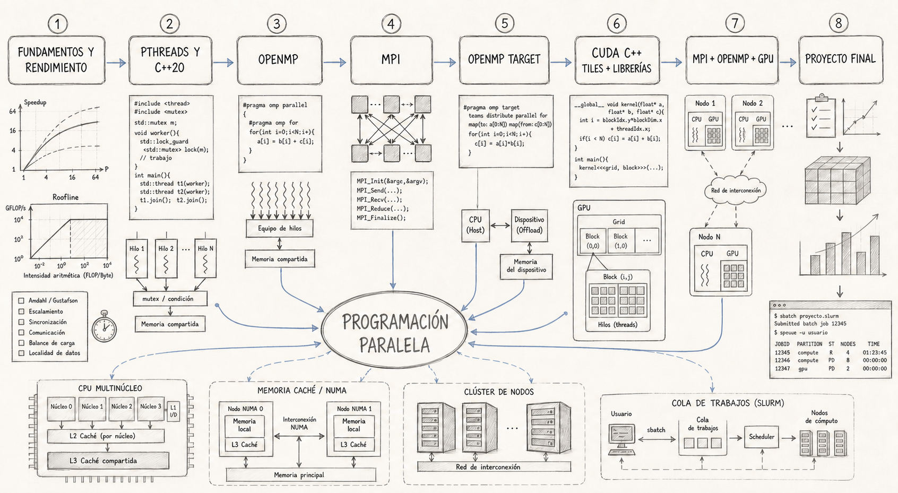

# Programación Paralela 2026

Curso universitario completo de programación paralela, diseñado para estudiar los fundamentos, la corrección y el rendimiento de aplicaciones sobre CPU multinúcleo, clústeres y GPU.

**Autor:** [Esteban Hernández B., PhD.](https://eshernan.github.io/)

**Perfiles:** [LinkedIn — HPC Colombia](https://www.linkedin.com/in/hpccol/) · [Página personal](https://eshernan.github.io/)



## Descripción

El curso está planeado para 19 semanas, con dos sesiones semanales de máximo dos horas. Comprende 38 sesiones y 76 horas presenciales, además del trabajo autónomo requerido para laboratorios y proyecto.

La ruta parte de los modelos de costo y la arquitectura de memoria; continúa con Pthreads, concurrencia en C++20, OpenMP y MPI; presenta aceleradores portables con OpenMP target; dedica un módulo completo a CUDA C++; y termina con programación híbrida, perfilado y un proyecto reproducible.

El repositorio también contiene una sección extracurricular de [tópicos avanzados](topicos_avanzados/README.md) sobre AMD ROCm/HIP, SYCL, Kokkos y RAJA. Esta ampliación no modifica la duración, las evaluaciones ni los resultados de aprendizaje obligatorios del curso base.

El principio metodológico es:

> Primero demostrar corrección; después medir; finalmente optimizar y explicar.

## Estructura académica

| Módulo | Contenido principal | Sesiones |
|---:|---|---:|
| 00 | Entorno reproducible, compilación, sistema, CPU, NUMA y afinidad | 2 |
| 01 | Fundamentos, Amdahl, Gustafson, escalado, memoria, Roofline y medición | 4 |
| 02 | Pthreads, sincronización, C++20, atomics y patrones de memoria compartida | 4 |
| 03 | OpenMP: datos, bucles, scheduling, reducciones, SIMD y tareas | 5 |
| 04 | MPI: punto a punto, no bloqueante, colectivas, topologías y Slurm | 6 |
| 05 | Aceleradores portables con OpenMP target | 3 |
| 06 | CUDA C++: modelo SIMT, memoria, tiling, reducciones, streams, bibliotecas aceleradas y Nsight | 6 |
| 07 | MPI+OpenMP, MPI+GPU, perfilado integral y diseño híbrido | 4 |
| 08 | Implementación, auditoría, presentación y defensa del proyecto final | 4 |
| | **Total** | **38** |

Cada módulo se explica mediante uno y como máximo tres notebooks. Los notebooks combinan conceptos, detalles del sistema, instrucciones de compilación, ejecución de fuentes independientes, experimentos reproducibles y gráficas generadas desde datos.

## Distribución semana a semana

| Semana | Sesiones | Contenido y entregables |
|---:|---:|---|
| 1 | 1–2 | Presentación, diagnóstico, entorno Linux, GCC/CMake, procesos, hilos, CPU, NUMA y afinidad. |
| 2 | 3–4 | Concurrencia y paralelismo, taxonomía de Flynn, descomposición, trabajo, span, Amdahl y Gustafson. |
| 3 | 5–6 | Cachés, coherencia, localidad, false sharing, vectorización, Roofline y metodología de medición. Evaluación de fundamentos. |
| 4 | 7–8 | Creación y ciclo de vida de Pthreads, partición, mutex, variables de condición, barreras y productor-consumidor. |
| 5 | 9–10 | `std::jthread`, RAII, atomics, modelo de memoria, carreras, deadlock y patrones compartidos. Laboratorio Pthreads/C++20. |
| 6 | 11–12 | Modelo fork-join de OpenMP, regiones paralelas, alcance de datos, `default(none)`, scheduling y afinidad. |
| 7 | 13–14 | Reducciones, atomics, SIMD, tareas, dependencias, granularidad y DAG. |
| 8 | 15–16 | Laboratorio OpenMP; introducción a MPI, comunicadores, rangos y ejecución con MPICH. |
| 9 | 17–18 | Comunicación punto a punto, tags, estados, deadlock, `MPI_Sendrecv` y comunicación no bloqueante. |
| 10 | 19–20 | Colectivas, costos, tipos derivados, topologías cartesianas y nociones de MPI-IO. |
| 11 | 21–22 | Escalado MPI y Slurm; inicio de aceleradores, offload, dispositivos y portabilidad. Laboratorio MPI. |
| 12 | 23–24 | OpenMP target, mapeo de datos, reducción, fallback en CPU y análisis transferencia/cómputo. |
| 13 | 25–26 | CUDA 13, `nvcc`, SIMT, grid/bloque/hilo, manejo de errores, memoria y coalescencia. |
| 14 | 27–28 | Memoria compartida, bancos, tiling, multiplicación de matrices, reducciones, primitivas de warp, Thrust y CUB. |
| 15 | 29–30 | cuBLAS/Lt, cuFFT, cuSPARSE, cuSOLVER y cuRAND; streams, ocupación, Nsight, Compute Sanitizer y laboratorio CUDA. |
| 16 | 31–32 | MPI+OpenMP, niveles de soporte de hilos, afinidad, MPI+CUDA/OpenMP target y asignación proceso-dispositivo. |
| 17 | 33–34 | Perfilado de extremo a extremo, comunicación/cómputo, reproducibilidad y revisión del diseño híbrido. |
| 18 | 35–36 | Clínica del proyecto, revisión cruzada, auditoría de reproducibilidad y ensayo de defensa. |
| 19 | 37–38 | Presentaciones, defensa, retrospectiva y cierre del curso. |

La descripción sesión por sesión, evaluaciones, rúbricas y bibliografía están en la [planeación completa](docs/PLANEACION_CURSO.md).

## Tecnologías incluidas

### Lenguajes y estándares

- C17 — ISO/IEC 9899:2018.
- C++20 — ISO/IEC 14882:2020.
- POSIX.1-2024 para Pthreads.
- OpenMP 5.2 como versión normativa del curso.
- MPI 5.0 como versión normativa.
- CUDA C++20 para el módulo NVIDIA.
- Python 3.14.6 únicamente para notebooks, análisis y visualización.

### Toolchain e implementaciones

- GCC/G++ 15.3.0 como compiladores abiertos principales.
- MPICH 5.0.1 como implementación MPI de referencia.
- CUDA Toolkit 13.0.x con GCC 15 como compilador host y GPU mínima Turing (`sm_75`).
- Bibliotecas CUDA 13: Thrust/CUB 3.0.1, cuBLAS/cuBLASLt, cuFFT, cuSPARSE, cuSOLVER y cuRAND.
- CMake 3.31, CTest y Ninja para construcción y pruebas.
- Slurm para ejecución en clúster.
- JupyterLab, NumPy, pandas y Matplotlib para explicación y gráficas.
- ThreadSanitizer, AddressSanitizer, `perf`, Compute Sanitizer, Nsight Systems y Nsight Compute para diagnóstico y perfilado.

### Extensión extracurricular

- AMD ROCm 7.2.3 e HIP 7.2.3.
- SYCL 2020, revisión 11, con AdaptiveCpp 25.10.0 como implementación abierta de referencia.
- Kokkos 5.1.1 para espacios de ejecución/memoria, `View` y políticas paralelas.
- RAJA 2025.12.2 para segmentos, políticas, kernels y recursos.

Estas tecnologías se estudian fuera del calendario de 19 semanas. Sus backends requieren perfiles independientes y hardware compatible; “portable” no significa que una única configuración produzca rendimiento óptimo en cualquier dispositivo.

CUDA es un tema obligatorio y dispone de seis sesiones propias. Incluye desde el modelo de programación y kernels correctos hasta tiling, primitivas jerárquicas y selección de bibliotecas aceleradas. El estudiante debe aprender qué función cumple cada biblioteca, su ciclo de integración y cuándo sus costos de preparación, transferencia o conversión pueden eliminar la ventaja. El compilador abierto principal continúa siendo GCC; `nvcc`, el runtime y las herramientas NVIDIA se utilizan exclusivamente en el módulo CUDA.

## Configuración global

La configuración única de compiladores, estándares, MPI, CUDA y versiones está en [`config/course-toolchain.cmake`](config/course-toolchain.cmake). Las dependencias se verifican en [`cmake/CourseDependencies.cmake`](cmake/CourseDependencies.cmake) y el stack de notebooks se fija en [`config/requirements.lock`](config/requirements.lock).

Presets disponibles:

```console
cmake --preset course-cpu
cmake --build --preset course-cpu
ctest --preset course-cpu
```

Para un nodo con CUDA 13 y GPU compatible:

```console
cmake --preset course-cuda
cmake --build --preset course-cuda
ctest --preset course-cuda
```

La guía de variables `COURSE_CC`, `COURSE_CXX`, `COURSE_MPI_ROOT` y `COURSE_CUDA_ROOT` está en [`config/README.md`](config/README.md).

## Organización del repositorio

```text
parallel_course/
├── CMakeLists.txt
├── CMakePresets.json
├── config/                         # Versiones, toolchain y stack Python
├── cmake/                          # Descubrimiento y validación de librerías
├── curso/
│   ├── notebooks/                  # 1–3 notebooks por tema
│   │   ├── 00_entorno/
│   │   ├── 01_fundamentos/
│   │   ├── 02_memoria_compartida/
│   │   ├── 03_openmp/
│   │   ├── 04_mpi/
│   │   ├── 05_openmp_target/
│   │   ├── 06_cuda/
│   │   ├── 07_hibrido/
│   │   └── 08_proyecto/
│   ├── ejemplos/                   # Fuentes seriales y paralelos compilables
│   └── ejercicios/
│       ├── <tema>/<ejercicio>/     # Enunciado, esqueleto y pruebas públicas
│       └── soluciones/
│           └── <tema>/<ejercicio>/ # Solución y pruebas docentes
├── topicos_avanzados/               # ROCm/HIP, SYCL, Kokkos y RAJA; fuera del curso base
│   ├── notebooks/
│   ├── ejemplos/
│   └── ejercicios/soluciones/
├── docs/                            # Planeación e imágenes
└── <directorios históricos>         # Material 2020 aún no certificado
```

Los directorios históricos de la raíz son material de referencia. Un ejemplo solo pasa a `curso/ejemplos/` después de corregirse, probarse, documentarse y registrar su procedencia.

## Relación entre notebooks, ejemplos y ejercicios

El flujo de cada tema es:

```text
Notebook conceptual
        ↓ ejecuta
Ejemplo serial + ejemplo paralelo
        ↓ producen datos y pruebas
Ejercicio con esqueleto y pruebas públicas
        ↓ se evalúa contra
Solución de referencia + pruebas docentes
```

### Ejemplos

Cada ejemplo debe incluir:

- fuente serial de referencia y versión paralela;
- construcción con CMake;
- manejo explícito de errores;
- pruebas de corrección antes de medir;
- exportación de métricas a CSV o JSON;
- README con compilación, ejecución y hardware requerido.

### Ejercicios

Cada ejercicio incluye un enunciado, resultados de aprendizaje, esqueleto, datos pequeños, salida esperada, pruebas públicas y rúbrica. Los criterios de rendimiento solo se aplican después de pasar corrección.

### Respuestas y soluciones

Las respuestas se almacenan en `curso/ejercicios/soluciones/<tema>/<ejercicio>/`. Durante el semestre deben permanecer en una rama privada o excluirse de la distribución estudiantil. Cada solución explica la descomposición, sincronización, validación, complejidad y metodología experimental.

## Lineamiento visual de notebooks

La ilustración de la cabecera es la referencia visual del curso. Siempre que una explicación requiera una imagen conceptual, se intentará mantener este lenguaje:

- boceto técnico hecho a lápiz de grafito;
- papel marfil o fondo blanco cálido;
- líneas finas, flechas y pequeñas anotaciones de ingeniería;
- sombreado mediante rayado suave;
- composición limpia y académica;
- grafito monocromático con acentos azul grisáceo discretos;
- sin fotografías, render 3D, colores saturados ni estética corporativa brillante.

Las gráficas cuantitativas deben generarse directamente desde los datos, conservar fondo claro y usar la misma paleta sobria. Capturas de herramientas como Nsight solo se incluyen cuando sean evidencia técnica imprescindible; no se estilizan de manera que se alteren sus datos.

## Estado de la reconstrucción

- Planeación de 38 sesiones: completada.
- Configuración global y presets: creados.
- Estructura de notebooks, ejemplos, ejercicios y soluciones: creada.
- Ruta extracurricular ROCm/HIP, SYCL, Kokkos y RAJA: diseñada y configurada; contenidos ejecutables pendientes.
- Migración y certificación del material histórico: en progreso.
- Desarrollo de todos los notebooks y soluciones: pendiente por tema.

Documentos de referencia:

- [Planeación semestral, evaluaciones y bibliografía](docs/PLANEACION_CURSO.md).
- [Estructura objetivo del curso](curso/README.md).
- [Planeación de tópicos avanzados](topicos_avanzados/README.md).

## Política de mantenimiento documental

Todo cambio de módulos, contenidos, semanas, tecnologías, notebooks, ejemplos, ejercicios o soluciones debe actualizar este README en el mismo commit. Si el cambio altera la ruta conceptual del curso, también debe revisarse la ilustración de cabecera y generarse una nueva versión cuando deje de representar fielmente el contenido.

Antes de cerrar un cambio se comprobarán, como mínimo, la suma de sesiones, la secuencia de semanas, los enlaces locales, la existencia de la imagen referenciada y la correspondencia entre este resumen y `docs/PLANEACION_CURSO.md`.

## Autoría

El diseño académico, la curaduría y la reconstrucción 2026 de este curso son autoría de **Esteban Hernández B., PhD.**

- LinkedIn: [https://www.linkedin.com/in/hpccol/](https://www.linkedin.com/in/hpccol/)
- Página personal: [https://eshernan.github.io/](https://eshernan.github.io/)

El material histórico o de terceros conserva sus avisos y licencias correspondientes. Consulte [LICENSE](LICENSE) y la documentación de procedencia antes de redistribuir componentes externos.
